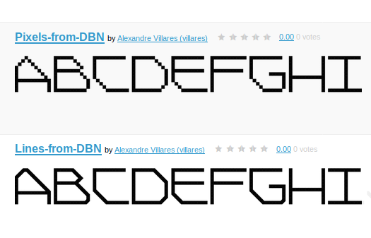

# DesignByNumbers-alphabet

#### Studies and derivatives of Maeda's [Design By Numbers](https://dbn.media.mit.edu/whatisdbn.html) 26 letter experiment

>***What is DBN?***
>
>*Design By Numbers was created for visual designers and artists as an introduction to computational design. It is the result of a continuing endeavor by Professor John Maeda to teach the “idea” of computation to designers and artists. It is his belief that the quality of media art and design can only improve through establishing educational infrastructure in arts and technology schools that create strong, cross-disciplinary individuals.*

About a year ago I wrote a sketch that would "translate" a set of DBN letter "commands" presented in the "DBN book", into Processing Python Mode equivalents (sort of).

### Processing Python Mode

- Code to parse the dbnletters.dbn file creating letter drawing functions in Processing Python Mode: [parse_dbn_letters](https://github.com/villares/DesignByNumbers-alphabet/tree/master/parse_dbn_letters)

- Code that generates, from the dbnletters.dbn data, the [dbn_letters.py](https://github.com/villares/DesignByNumbers-alphabet/tree/master/dbn_letters_example/dbn_letters.py) code for use with Processing Python Mode: [generate_dbn_letters_py](https://github.com/villares/DesignByNumbers-alphabet/tree/master/generate_dbn_letters_py) 

- An example sketch using the generated code: [dbn_letters_example](https://github.com/villares/DesignByNumbers-alphabet/tree/master/dbn_letters_example)

- Some other dead ends: maybe soon here

### Font derivations

- A pixel font with the same pixels:[pixels-from-DBN](https://fontstruct.com/fontstructions/show/1628742/pixels-from-dbn)

- And I've created a derivative font: [lines-from-DBN](https://fontstruct.com/fontstructions/show/1628754/)
